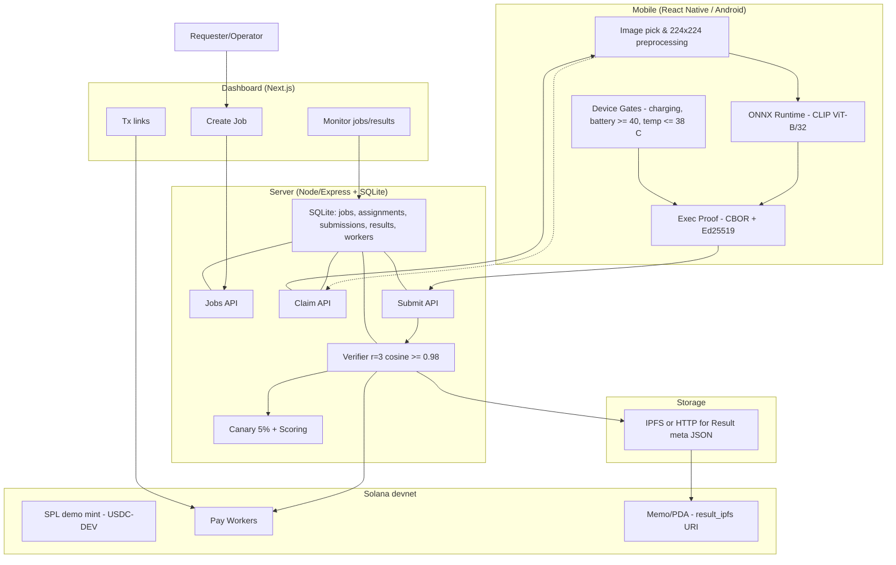
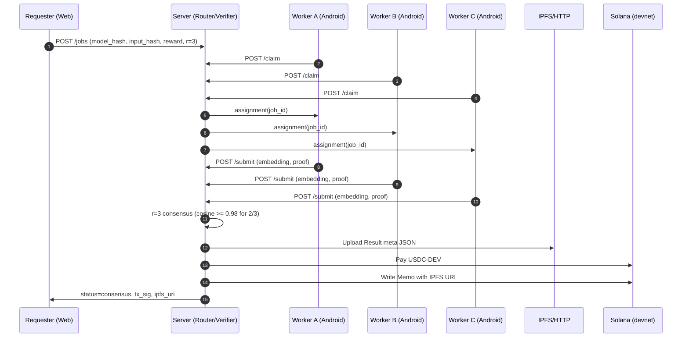

# Edge Bounty — System Architecture (MVP)

## Overview
This document describes the system architecture for the **Edge Bounty** MVP: an Android-only, smartphone-native inference marketplace that performs CLIP embeddings on device, reaches redundant consensus (r=3), and settles rewards on **Solana devnet** with a Result meta URI stored on chain (Memo/PDA) and JSON stored on **IPFS/HTTP**.

---

## Component Diagram

---

## Sequence Diagram

---

## Module Decomposition

### Mobile (React Native / Android)
- **Image input & preprocessing**: Controlled 224x224 input for MVP (future: full PNG/JPEG decode and resize).
- **On-device inference**: `onnxruntime-react-native` running CLIP ViT-B/32; L2-normalized embeddings.
- **Exec proof**: CBOR payload (model_hash, input_hash, latency_ms, battery, temp, ts) signed with Ed25519 (tweetnacl for MVP; Android Keystore later).
- **Device gates**: Charging only, battery >= 40, temperature <= 38 C, with native module polling.
- **Networking**: `/claim` to get an assignment, `/submit` to send embedding + proof.

### Server (Node/Express + SQLite)
- **APIs**: `/jobs`, `/claim`, `/submit`, `/results`.
- **Assignment**: Simple round-robin or earliest-unfilled to hit `r=3`.
- **Verifier**: Pairwise cosine among 3 embeddings; consensus if at least 2 pairs >= 0.98.
- **Canary**: ~5% jobs with known output; adjust worker score on failure.
- **Reassignment**: Timeout and re-queue if a worker stalls.
- **Storage (SQLite)**: `jobs`, `assignments`, `submissions`, `results`, `workers` (score).
- **IPFS/HTTP**: Upload Result meta JSON; fallback to static HTTP under `/public`.

### Chain (Solana devnet)
- **SPL demo mint**: USDC-DEV for payouts.
- **Settlement**: Transfer to worker pubkeys after consensus.
- **Recording**: Write Result meta URI to chain via Memo or PDA (simple account).

### Web (Next.js Dashboard)
- **Create Job**: Form to post `/jobs`, hashing input locally.
- **Monitor**: Poll `/jobs` and `/results`; show consensus, cosine_min, ipfs_uri, tx_sig.
- **Explorer links**: Link to Solana devnet explorer for TX verification.

---

## Data Flow & Storage

1. **Image (device)** -> controlled input (224x224), not uploaded.
2. **Preprocessing & Embedding (device)** -> Float32 embedding (L2-norm).
3. **Exec proof (device)** -> CBOR + Ed25519 signature.
4. **Submission (network)** -> `embedding`, `proof`, `latency_ms` to Server.
5. **Verification (server)** -> Store in `submissions`; when count==3, compute pairwise cosine; if 2 pairs >= 0.98 -> **consensus**.
6. **Result meta (server)** -> JSON with job_id, consensus metrics, worker list; upload to IPFS or HTTP fallback.
7. **Settlement (chain)** -> SPL token transfer (USDC-DEV) to workers; write Memo or PDA with `result_ipfs` URI.
8. **Recording (server/db)** -> Insert into `results` with `ipfs_uri`, `tx_sig`.
9. **Dashboard** -> read-only monitoring.

**Storage map**
- **Device**: volatile image and tensors only.
- **Server SQLite**: jobs, assignments, submissions (embeddings JSON), results, workers.
- **IPFS/HTTP**: Result meta JSON.
- **Solana**: Memo/PDA text (URI) + token transfers (TX history).

---

## Security & Reliability

- **Key management**: MVP uses `tweetnacl` in-app keypair; **future**: Android Keystore/StrongBox + Key Attestation.
- **Signing**: Exec proof CBOR signed with Ed25519; server records signature alongside submission.
- **Canary & reputation**: Canary ~5% with known outputs; failures lower score and reduce assignment priority.
- **Replay & tamper**: Input_hash and model_hash bound in proof; server enforces job_id uniqueness per worker.
- **Privacy**: No raw inputs off device; only embeddings and proof.
- **Retries & backoff**: Client resubmits on network errors; server has timeout and reassignment logic.
- **Rate limiting**: Basic per-pubkey throttling to deter spam (MVP-level).

---

## Performance Targets

| Metric | Target |
|---|---|
| Median embedding latency (device) | <= 3 s |
| Verifier compute latency (server) | <= 200 ms per job (3 embeddings) |
| End-to-end time (claim to payout) | <= 10 s on devnet path |
| Consensus success rate | >= 95% on demo set |
| Canary pass rate | >= 99% |

**Capacity goal (demo):** 500 concurrent workers with r=3 batches for small images.

---

## Future Extensions

- **Token-22 (transfer hooks)**: Enforce region/KYC, freezing, and programmable fees for production payouts.
- **Compressed NFTs (state compression)**: Cheap at-scale logging of Result records with Merkle proofs.
- **Whisper / Audio tasks**: On-device speech-to-text with tiny models; adapt consensus to WER thresholds.
- **StrongBox + Attestation**: Bind worker identity to attested device keys; reduce Sybil and spoofing.
- **Dynamic r & pricing**: Adjust redundancy and reward based on model difficulty and reputation.
- **zk-verified execution**: Optional zkVM/zkML proofs for selected models or sample batches.

---

## Notes
Scope is intentionally minimalistic to ensure 36-hour delivery. The above future items should be first on the post-submission roadmap.
