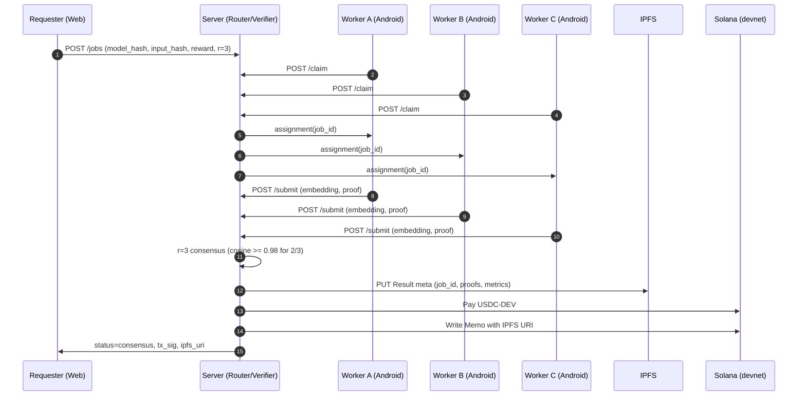

# Edge Bounty — Smartphone-Native Inference Marketplace (MVP One-Pager)

## Problem
- Billions of smartphones sit idle while charging; their on-device AI accelerators are underused.  
- Centralized inference is costly, latency-prone, and privacy-sensitive (raw data upload).  
- There’s no simple, verifiable way to **pay** phones for **correct** micro-inference.

## Solution
Turn Android phones into **micro inference nodes** that run CLIP embeddings on-device and submit results redundantly (r=3). A verifier reaches consensus (cosine ≥ 0.98 for 2/3 matches), mints a **Result meta** to IPFS, and pays **USDC-DEV** on **Solana devnet**. No raw input leaves the device—only embeddings + signed execution proof.

## Key Features
- **On-device inference**: CLIP ViT-B/32 embeddings (224×224), RN + onnxruntime-react-native.  
- **Worker safety gates**: run only while **charging**, battery ≥ 40%, temp ≤ 38 °C.  
- **Redundant consensus**: r=3; 2/3 cosine agreement ≥ 0.98 (+ 5% canary jobs).  
- **Instant settlement**: USDC-DEV payouts on Solana devnet; IPFS URI recorded on-chain (Memo/PDA).  
- **Minimal ops**: Single Node service (Router + Verifier + SQLite), Next.js dashboard.

## User Flow (Text)
1) Requester posts a Job (model_hash, input_hash, reward).  
2) Workers claim → run CLIP locally → submit embedding + signed exec_proof.  
3) Verifier forms r=3 cohort → checks cosine agreement → passes/fails.  
4) On pass: upload Result meta to IPFS → pay workers on Solana → dashboard shows Tx + meta.

## Sequence (Mermaid)

## Non-Functional (Safety & Performance)
- **Safety/Privacy**: On-device inference only; no raw inputs uploaded. Signed exec_proof; canary jobs; simple reputation.  
- **Reliability**: r=3 redundancy; timeout reassign; backoff retries.  
- **Performance targets**: single-image embedding **≤ 3s** median on mid-tier Android; end-to-end **≤ 10s** to payout on devnet.

## KPIs
- **Technical**: ≥95% consensus success rate; canary pass ≥99%; median embedding latency ≤3s; verifier fail <1%.  
- **Economic**: worker earnings **$0.10–$0.30/hr** (charging idle), cost per job ≤ $0.01 (demo economics).  
- **Ops**: ≥500 concurrent workers; dashboard live updates <2s lag.

## Constraints & Future Work
- **MVP Constraints**: Android-only; CLIP-only; USDC-DEV (demo mint); on-chain record via Memo/PDA; no state compression.  
- **Future**: Token-2022 (KYC/region hooks), compressed NFTs for massive logging, Whisper (audio), StrongBox/Key Attestation, zk-verified execution, dynamic pricing & r-adaptation.

## Differentiation (Quick Compare)

| Project            | Device Focus | Verification | Chain/Settlement         | Smartphone-Native UX |
|--------------------|--------------|--------------|--------------------------|----------------------|
| **Edge Bounty (this)** | **Smartphone (Android)** | **r=3 cosine + canary** | **Solana devnet, USDC-DEV, Memo/PDA** | **Yes (charging/thermal gates)** |
| Bittensor         | Any nodes    | Network scoring | Custom / TAO economy     | No (not phone-first) |
| Nosana (Solana)   | GPU/servers  | Job validation | Solana                   | No                   |
| AIOZ              | Edge nodes   | Platform-defined | Native chain             | Partial              |
| NATIX (DePIN data)| Smartphones  | Data tasks    | Tokenized rewards        | Phone-first (data), not inference |

**Tagline:** *Pay phones for correct micro-inference—redundantly verified, instantly settled.*
